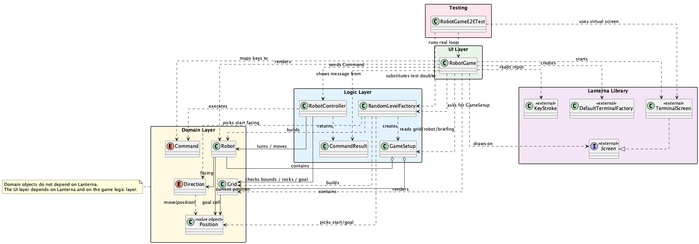
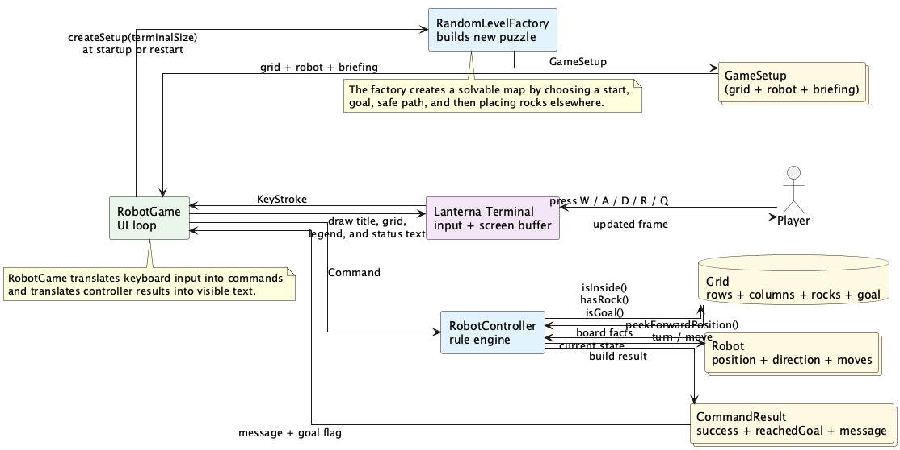
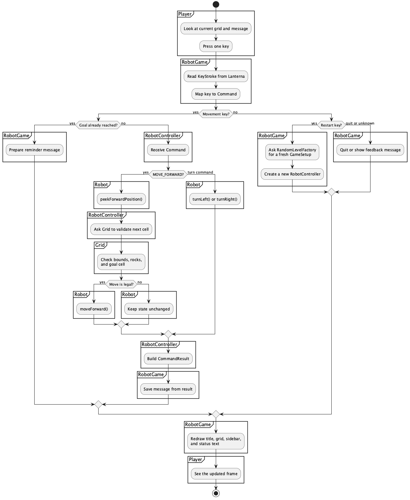

# Java Workshop 04: Simple Console Game: Soft Robot Controller 

This project is a **software-only robot** that lives in your terminal: no hardware, no sensors—just a virtual robot on a grid. You control it with the keyboard: turn left or right, then move forward one step at a time. The idea is deliberately simple (robot-on-a-grid) so we can focus on clear class design, separation of concerns, and how input and game rules work together.

The robot has a position, a direction, and a set of keyboard controls. Each time the game starts, it builds a fresh random map with a guaranteed safe route to the goal, so you get a new puzzle every run.

This README is written as a **teaching guide** for students. It is deliberately a bit verbose: the goal is to walk you through the design and the code, not just list facts. In the following sections you will find:

- what each class is responsible for
- how the objects work together
- how keyboard input becomes robot movement
- how the random grid is generated
- how Lanterna is used to draw the terminal UI
- how automated testing works (including end-to-end tests with a virtual terminal)

To make the **console** feel like a real interactive game instead of a stream of `println` output, we use an external library—similar to how C programs use **ncurses** to build terminal UIs. In this project we use **Lanterna**, a Java library that turns the terminal into a controllable display and keyboard-driven application. That way we can focus on OOP design and game logic while the library handles the low-level details of talking to the console.

Lanterna gives us:

- **A buffered screen** — we draw to an off-screen buffer and then refresh, so the game can redraw the whole grid and sidebar in one go instead of appending line by line.
- **Structured keyboard input** — key presses become objects (e.g. `KeyStroke` with type `ARROW_UP` or `CHARACTER 'w'`) instead of raw bytes, so our code can map keys to commands cleanly.
- **Terminal size and resize handling** — we can detect when the user resizes the window and adjust the layout (e.g. put the sidebar beside the grid or below it) so the game still fits.
- **Virtual terminals for testing** — tests can use a fake terminal in memory, feed scripted key presses, and assert on the result without a human at the keyboard.

Later sections (including “How The Vendored Lanterna Source Works”) go into more detail. The main idea here is: we use Lanterna so the console becomes a proper interactive playground for our toy robot, and so students can see how a real UI library fits into an OOP design.

## Table of Contents

- [Big Idea](#big-idea)
- [Concepts Covered](#concepts-covered)
- [Quick Start](#quick-start)
- [Figures](#figures)
  - [Class relationships](#class-relationships)
  - [Data flow](#data-flow)
  - [Sample flow of one turn](#sample-flow-of-one-turn)
- [Project Story](#project-story)
- [High-Level Structure](#high-level-structure)
  - [1. Domain layer](#1-domain-layer)
  - [2. Game logic layer](#2-game-logic-layer)
  - [3. UI layer](#3-ui-layer)
- [Files that you may want to pay attention to](#files-that-you-may-want-to-pay-attention-to)
- [How to Run It](#how-to-run-it)
- [How the Lanterna source works](#how-the-lanterna-source-works)
- [Automated Testing](#automated-testing)
- [Controls](#controls)
- [How The Program Runs](#how-the-program-runs)
  - [Step 1. main creates the Lanterna screen](#step-1-main-creates-the-lanterna-screen)
  - [Step 2. runGameLoop creates the first game](#step-2-rungameloop-creates-the-first-game)
  - [Step 3. The loop repeats until the player quits](#step-3-the-loop-repeats-forever-until-the-player-quits)
  - [Step 4. Keys are translated into commands](#step-4-keys-are-translated-into-commands)
  - [Step 5. The controller applies the rules](#step-5-the-controller-applies-the-rules)
  - [Step 6. A CommandResult comes back](#step-6-a-commandresult-comes-back)
  - [Step 7. The next frame is drawn](#step-7-the-next-frame-is-drawn)
- [How Random Map Generation Works](#how-random-map-generation-works)
  - [Goal](#goal)
  - [The algorithm](#the-algorithm)
  - [Why build a safe path first?](#why-build-a-safe-path-first)
- [How Drawing Works](#how-drawing-works)
- [OOP Lessons In This Project](#oop-lessons-in-this-project)
  - [1. Encapsulation](#1-encapsulation)
  - [2. Separation of concerns](#2-separation-of-concerns)
  - [3. Abstraction](#3-abstraction)
  - [4. Composition](#4-composition)
  - [5. Immutability](#5-immutability)
- [Suggested Reading Order For Students](#suggested-reading-order-for-students)
- [A Full Example Of One Key Press](#a-full-example-of-one-key-press)
- [Make sure you understand](#make-sure-you-understand)
- [Ideas for Game Extensions](#ideas-for-game-extensions)

## Big Idea

This project is designed around a very important OOP idea:

- each class should have one clear job

Instead of putting everything in one giant `main` method, we give each concern its own class:

- **`Robot`** — Stores the robot’s own state only: position, facing direction, and how many moves it has made. It does *not* know about the grid, rocks, or the keyboard; it just answers “where would I be if I moved forward?” and “turn left/right.”
- **`Grid`** — Stores the board: number of rows and columns, which cells have rocks, and where the goal (charging station) is. It answers questions like “Is this position inside the grid?” and “Is there a rock here?” but does not know about the robot.
- **`RobotController`** — The rule engine. It owns the grid and the robot and decides whether a move is allowed (e.g. cannot step off the board or onto a rock). The UI sends commands here; the controller executes them and returns a result message. Game rules live in this class, not in the UI.
- **`RandomLevelFactory`** — Builds a new puzzle on demand: grid size, start and goal positions, a safe path between them, and rocks everywhere else. Returns a `GameSetup` (grid + robot + briefing) so each run or “press R” gives a fresh, solvable level.
- **`RobotGame`** — The user-interface layer. It talks to Lanterna: reads key presses, draws the screen (grid, sidebar, messages), and turns keys into commands that it sends to the controller. It does *not* decide if a move is legal; it only displays what the controller reports.

That separation makes the code easier to read (each file has one job), test (e.g. you can test the controller without a screen), and extend (e.g. add a new command without touching the grid or the drawing code).

## Concepts Covered

This project reinforces several core programming ideas; each one appears in a concrete way in the code:

- **Classes and objects** — The game world is modeled as objects (`Robot`, `Grid`, `Position`, etc.). You create instances, call methods on them, and pass them around instead of juggling loose variables.
- **Coordinates with `row` and `column`** — We use a 2D grid with zero-based row and column indices. The `Position` class wraps one cell; `Direction` describes how row/column change when the robot moves (e.g. North = row − 1).
- **Object state** — The robot’s position, direction, and move count change over time as the player gives commands. The grid’s rocks and goal are fixed for one level. Seeing what changes and what stays the same is part of understanding state.
- **Enums** — `Direction` (NORTH, EAST, SOUTH, WEST) and `Command` (MOVE_FORWARD, TURN_LEFT, TURN_RIGHT) are enums: a fixed set of named values so the code is readable and the compiler can help catch typos.
- **Loops** — The game loop (read key → update → draw) runs until the user quits. The level generator uses loops to build the safe path and place rocks. Iterating over grid rows and columns is used in both drawing and logic.
- **Method responsibility** — Each method has one job: e.g. `peekForwardPosition()` only computes the next cell; the controller decides whether the robot is allowed to move there. Keeping methods focused makes the design easier to follow and test.
- **Terminal user interfaces** — Instead of a web page or a GUI window, the game runs in the terminal. We use the Lanterna library to draw the grid, read keys, and handle resize, so you see how a text-based UI is structured (buffer, refresh, input).
- **Testing** — The project includes automated tests (JUnit 5). The main tests are *end-to-end*: they start a virtual terminal, feed in scripted key presses, and assert that the robot and game state change correctly. That shows how to test an interactive program without a human at the keyboard, and how to use a *test double* (e.g. a scripted level factory) to make tests predictable.

## Quick Start

From the project root:

| Goal        | Command        |
|------------|----------------|
| Compile    | `./compile.me`  |
| Run the game | `./run.me`   |
| Generate Javadocs | `./doc.me` |
| Run tests  | `./runme`      |

Compile once (or after changing code); then use `./run.me` to play, `./doc.me` to generate HTML Javadocs, or `./runme` to run the test suite. See **How to Run It** and **Automated Testing** below for more detail.

## Figures

### Class relationships

This diagram gives you the **structural view** of the project. It answers questions such as:

- Which classes belong to the **domain layer** (the game world itself)?
- Which classes belong to the **game-logic layer** (rules and level generation)?
- Which class belongs to the **UI layer** (drawing and keyboard input)?
- Which classes **use**, **create**, or **contain** other classes?

When you read this diagram, start with **`RobotGame`** at the UI layer. It depends on many other classes because it is the top-level coordinator: it starts Lanterna, asks `RandomLevelFactory` for a `GameSetup`, creates a `RobotController`, reads keys, and draws the current state. From there, follow the arrows downward into the logic and domain layers to see how the UI relies on lower-level objects instead of putting all logic in one place.

The domain layer is intentionally simpler. `Robot` stores the robot's own state, `Grid` stores the board state, `Position` represents one cell, and enums such as `Direction` and `Command` keep the valid values clear and limited. A very important teaching point is that these classes do **not** depend on Lanterna. In other words, the game world and rules can exist even without the terminal UI.

The logic layer sits in the middle. `RobotController` applies the rules of movement, `RandomLevelFactory` creates a fresh solvable puzzle, `GameSetup` groups together the starting pieces for one game, and `CommandResult` carries the outcome of one action back to the UI. This middle layer is what lets the project stay clean: the UI asks for work to be done, and the logic layer decides what actually happens.

So the big lesson from this diagram is **dependency direction**: the UI depends on the game logic and domain objects, but the core game objects do not depend on the UI. That one idea is a major part of good OOP design because it makes the code easier to test, reason about, and extend.



### Data flow

This diagram gives you the **runtime view** of the project. Instead of focusing on “which class knows which class,” it focuses on **what information moves through the system** while the game is running.

The flow begins with the **player** and the **terminal**. A key press such as `W`, `A`, `D`, `R`, or `Q` is captured by Lanterna and turned into structured input for `RobotGame`. The UI does not directly change the robot at that point. Instead, it translates the input into a command or restart/quit action and sends the important part of that input to the correct object.

From there, two major data paths exist. At startup or restart, `RobotGame` asks `RandomLevelFactory` to create a new `GameSetup`, which contains a fresh `Grid`, `Robot`, and briefing message. During normal play, `RobotGame` sends a `Command` to `RobotController`, which checks the `Grid`, inspects or updates the `Robot`, and builds a `CommandResult`.

That `CommandResult` is important because it carries information **back** to the UI: whether the move succeeded, whether the goal was reached, and what text message should be shown. Then `RobotGame` redraws the title, grid, legend, and sidebar based on the latest robot and grid state, and Lanterna shows the updated frame to the player.

This diagram is useful because it helps students separate **objects that store state** from **processes that move information around**. `Robot` and `Grid` are not just boxes on a screen; they are the main sources of state. `RobotGame`, `RandomLevelFactory`, and `RobotController` act more like processors that read state, transform it, and send the results onward.



### Sample flow of one turn

This swimlane diagram zooms in further and shows a **single turn** in detail. It is the best diagram for understanding the question: “What exactly happens after the player presses one key?”

Each vertical lane represents one participant with one main responsibility: the **Player** acts, **RobotGame** reads and interprets input, **RobotController** applies the rules, **Robot** changes its own internal state when told to do so, and **Grid** answers board-related questions such as whether a move is inside the map or blocked by a rock.

Read the diagram from top to bottom. The player presses a key, `RobotGame` reads the key and maps it to a command, and then the flow branches depending on what kind of key it was. If it is a movement or turning command, the controller handles it. If it is a restart key, the UI asks for a fresh setup. If it is quit or unknown input, the UI handles that case differently. That branching is important because real programs rarely have only one straight-line path.

For a forward move, the diagram shows an especially important OOP pattern: `RobotGame` does **not** move the robot directly. Instead, `RobotController` asks the `Robot` for the next position, asks the `Grid` whether that move is legal, and only then tells the `Robot` to move. This keeps the rules in the controller and keeps the robot focused on its own state.

After the rule check, the controller creates a `CommandResult`, the UI stores the message, and the screen is drawn again. So the full story of one turn is not only “input causes motion”; it is really **input → interpretation → rule checking → state update → result message → redraw**. That is the main sequence students should notice in this diagram.




## Project Story

The player controls a robot called **Robo**: a software-only character that lives in the terminal. There is no physical robot, no motors or sensors—just a virtual toy that moves on a grid when you press keys. That simplicity is deliberate so we can focus on how the program is structured.

- The robot starts at a random location.
- The goal cell is the charging station.
- Rocks block movement.
- The player turns the robot and moves it forward.
- Pressing `R` generates a completely new puzzle.

Even though the game is simple, it teaches you a lot of important programming ideas:

- state changes over time
- input drives behavior
- objects cooperate with one another
- **we can separate game rules from display logic** — The idea behind patterns like **Model–View–Controller (MVC)** shows up here: the *model* (grid, robot, rules) lives in domain and controller classes; the *view* is the Lanterna drawing in `RobotGame`; the *controller* (`RobotController`) decides what happens when the player acts. The UI does not decide if a move is legal; it only displays the result. That separation keeps the code easier to test and change. You will see these ideas again in more advanced second-year courses (e.g. GUI frameworks and software design and architecture).

## High-Level Structure

There are three layers in this project.

### 1. Domain layer

These classes describe the game world itself.

- `Position`
- `Direction`
- `Command`
- `CommandResult`
- `Robot`
- `Grid`

### 2. Game logic layer

These classes decide how a game is created and how commands affect it.

- `RobotController`
- `RandomLevelFactory`
- `GameSetup`

### 3. UI layer

This class talks to Lanterna and draws the game in the terminal.

- `RobotGame`

## Files that you may want to pay attention to: 

### `src/Position.java`

`Position` stores one location on the board.

- `row` tells us which horizontal line the cell is on
- `column` tells us which vertical slot the cell is in
- `translate(...)` creates a new position relative to the old one
- `sameCell(...)` checks whether two positions refer to the same grid cell

This class is intentionally very small—and that is good design. A class that does one thing (here: represent a cell on the grid) is easier to understand, easier to test, and less likely to break when you change other parts of the program. **Position** is a good example of a **POJO** (Plain Old Java Object): no framework magic, no inheritance from a library base class—just fields (`row`, `column`), a constructor, getters, and a few simple methods. POJOs are easy to reason about and reuse; many real-world projects rely on small, focused classes like this.

Later, in enterprise-grade projects (e.g. Java EE or Spring), you will meet heavier building blocks such as **EJBs** (Enterprise Java Beans) or framework-managed beans—classes that depend on containers, annotations, and configuration. The idea is similar: each component has a clear role. POJOs and value objects like **Position** remain the foundation; the more complex pieces often wrap or use them. Getting comfortable with small, clear classes now will make those later concepts easier to follow. 

### `src/Direction.java`

**Java enums** are a way to define a **fixed set of named constants** as a type. Instead of using magic numbers or strings (e.g. `1` for North, `"EAST"` for East), you declare the allowed values once, and the compiler ensures that only those values can be used. Enums are used whenever you have a small, closed set of options: compass directions, days of the week, order status (PENDING, SHIPPED, DELIVERED), or—as in this project—the four directions the robot can face and the three commands it can execute. They make code readable (`Direction.NORTH` instead of `-1`), and they prevent invalid values (you cannot accidentally pass a fifth direction). In this project, **Direction** and **Command** are both enums.

`Direction` is an enum with four values:

- `NORTH`
- `EAST`
- `SOUTH`
- `WEST`

Each direction stores how movement changes the coordinate.

Examples:

- moving north changes the row by `-1`
- moving east changes the column by `+1`

It also contains:

- `turnLeft()`
- `turnRight()`
- `move(Position position)`

This is a nice example of putting behavior inside the enum instead of scattering turning logic all over the project.

### `src/Command.java`

`Command` represents the actions our robot understands.

- `MOVE_FORWARD`
- `TURN_LEFT`
- `TURN_RIGHT`

We use an enum because the set of valid commands is fixed and small.

### `src/CommandResult.java`

When the player presses a key, we do not just want "yes" or "no".

We want to know:

- did the command succeed?
- did the robot reach the goal?
- what message should we show to the player?

That is why `CommandResult` exists.

### `src/Robot.java`

`Robot` stores the robot's own state:

- name
- current position
- facing direction
- number of successful forward moves

Important design choice:

- `Robot` does not know about rocks or screen drawing

That is the controller's job, not the robot's job.

### `src/Grid.java`

`Grid` stores the board:

- number of rows
- number of columns
- rock locations
- goal location

Rocks are stored in a `boolean[][]` array.

That means:

- `true` means there is a rock in that cell
- `false` means there is no rock in that cell

Important methods:

- `isInside(...)`
- `hasRock(...)`
- `isGoal(...)`
- `addRock(...)`

### `src/RobotController.java`

`RobotController` is one of the most important classes in the whole project.

This class is the rule engine.

Its job is to answer questions like:

- can the robot move forward?
- is there a rock in the next cell?
- would the robot leave the board?
- what message should the player see?

This is a good OOP habit:

- UI code should not decide game rules
- rule code should not draw the UI

### `src/GameSetup.java`

`GameSetup` is a small container class that groups together:

- the grid
- the robot
- the opening message

This makes it easier for `RandomLevelFactory` to return one object instead of several separate pieces.

### `src/RandomLevelFactory.java`

This class creates a brand-new puzzle.

Its job is to:

1. choose a board size
2. choose a robot start position
3. choose a goal position
4. build a guaranteed safe path
5. place rocks on other cells

This class is a strong example of abstraction:

- the rest of the program does not need to know how level generation works
- it only needs a finished `GameSetup`

### `src/RobotGame.java`

`RobotGame` is the Lanterna UI class.

It is responsible for:

- creating the terminal screen
- reading key presses
- starting and restarting the game
- drawing the title, grid, sidebar, and messages
- reacting to terminal resize events

**Here is an overview of what we are doing here:**

**1. The job of the UI layer.**  
`RobotGame` is the only class that talks directly to the terminal. Its job is to *present* the game and *forward* user input. It does not decide whether a move is legal, where rocks are, or how the level is built. Those decisions live in `RobotController`, `Grid`, and `RandomLevelFactory`. By keeping all terminal and drawing code in one place, we make the rest of the program independent of Lanterna and easy to test without a real screen.

**2. Starting up.**  
In `main`, we create a Lanterna terminal and screen: a `DefaultTerminalFactory`, an initial size, and a `TerminalScreen`. We then hand that screen to `runGameLoop`. That way, the game runs in a buffered text display instead of a raw console, so we can redraw the whole frame (grid, sidebar, messages) in one go instead of appending lines.

**3. The game loop.**  
Inside `runGameLoop`, we create the first level (via `RandomLevelFactory`), a `RobotController`, and a message string. Then we loop: sync the screen size in case the user resized the window, draw the current frame, read one key, and react. The loop runs until the user quits (e.g. Q or EOF). Restart (R) is handled by creating a new `GameSetup` and a new controller, so the next iteration draws and reacts using the new state.

**4. From keys to commands.**  
When a key is read, we map it to a `Command` (move forward, turn left, turn right) or to a special action (quit, restart). Unknown keys produce a “that key does not control Robo” message. We do not interpret keys as game rules; we only turn them into commands and pass them to the controller. The controller returns a `CommandResult` (success/failure, goal reached or not, message), and we display that message and, if the goal was reached, append a short “Mission complete” line.

**5. Drawing one frame.**  
Each frame we clear the screen, then draw the title, instructions, grid (with row/column labels and one symbol per cell: robot, goal, rock, or empty), and the sidebar (robot name, position, direction, goal, move count, legend, and the current message). We choose colors and symbols so the robot, goal, and rocks are easy to see. If the terminal is too small to show the full grid, we draw a “terminal too small” message instead of crashing. Layout (sidebar beside or below the grid) is chosen from the current terminal size so the game adapts to the window.

**6. Safety and layout.**  
We avoid drawing outside the terminal by clipping text to the visible area (`safePutString`). We also handle resize: at the start of each loop we call `syncScreenSize` so our layout and drawing use the latest dimensions. Long messages in the sidebar are wrapped to a few lines so the panel stays readable. All of this is orchestration: the UI has to coordinate size, layout, and many small drawing steps, which is why this class has more methods and branches than the domain or controller classes.

**7. Why this class is larger.**  
UI code often needs more orchestration than domain or logic code. One class is responsible for startup, the loop, key mapping, drawing the grid, drawing the sidebar, choosing layout, handling “too small” and resize, and safe string placement. Each of those is a clear sub-task, but there are many of them, so the file is longer. The important point is that `RobotGame` still has one overall responsibility: *the interface between the player and the rest of the game*. It does not contain game rules or data structures for the board; it only displays and forwards input.

`RobotGame` depends on `RobotController`, `Grid`, `Robot`, and the supporting types (`Position`, `Direction`, `Command`, `CommandResult`, `GameSetup`, `RandomLevelFactory`). It gets the current state from the controller and the level factory, draws that state, and sends commands back to the controller. So the flow is: *input → RobotGame (map key to command) → RobotController (apply rules, update robot/grid) → RobotGame (draw updated state)*. That separation of concerns is what allows us to test the controller without a terminal and to change the UI (e.g. different keys or layout) without touching the game rules.

## How to Run It

Compile:

```bash
./compile.me
```

Run:

```bash
./run.me
```

Generate the Javadocs:

```bash
./doc.me
```

This writes the generated HTML documentation to `docs/javadoc/index.html`.

Run the automated tests:

```bash
./runme
```

This project builds against the local [Lanterna](https://github.com/mabe02/lanterna) source checkout in `vendor/lanterna`, so `compile.me` installs that source build before compiling the game.

## How the Lanterna source works

 The `vendor/lanterna` folder is a full local copy of the Lanterna library source code. That means the project does not treat Lanterna as a hidden black box downloaded from the internet every time. Instead, students can open the library files, read the code, and see how a real Java terminal UI library is organized internally.

 Our own game code lives in `src`, while the library code lives in `vendor/lanterna`. That separation is important because it teaches a common software-engineering idea: your application code uses other people's libraries, but those libraries are usually large projects with their own design, packages, tests, and build files. Seeing both side by side helps students understand where their code ends and where a dependency begins.

 The word "vendor" here means "we copied in the dependency source on purpose." Teams sometimes vendor a library when they want stable builds, local debugging, or the ability to inspect the exact version they are using. In a teaching project, vendoring is especially useful because students can trace a method call from their own game directly into the library that powers it.

 Lanterna itself is not our game. Lanterna is a reusable toolkit for making terminal applications in Java, and our robot game is one example program built on top of that toolkit. Students should think of Lanterna the same way they think of a graphics engine or a collections library: it provides tools and abstractions, while our classes decide the game rules and story.

 The build process shows how the vendored source becomes available to our project. When `compile.me` runs, it first executes Maven inside `vendor/lanterna` and installs Lanterna into the local Maven repository on the computer. After that, our main `pom.xml` can depend on that locally built artifact just like it would depend on a library from Maven Central.

 This local-install step is the bridge between the two projects. The Lanterna source tree has its own `pom.xml`, source folders, and package structure, so Maven treats it as a standalone Java library. Once Maven installs it locally, our robot project can say "I depend on `com.googlecode.lanterna:lanterna:3.2.0-SNAPSHOT`" and the compiler knows where to find those classes.

 One big-picture idea inside Lanterna is that it separates low-level terminal access from higher-level screen drawing. A raw terminal can print characters, move the cursor, change colors, and read key presses, but doing that directly is awkward. Lanterna wraps those details in objects so applications like our game can think in terms of screens, text graphics, and key strokes instead of raw escape sequences.

 The `terminal` package in Lanterna is the lower layer. It deals with the concept of a terminal window itself: size, cursor position, text output, input events, and resize notifications. When students see `DefaultTerminalFactory` in our game, they are using this lower layer indirectly to create the real terminal connection.

 The `screen` package sits on top of the terminal package and gives us a buffered drawing model. Instead of printing every character directly to the terminal one by one, we draw into a screen buffer and then call `refresh()`. This is why our UI feels more like a game screen than a stream of `println(...)` calls, and it also explains why `TerminalScreen` is one of the most important Lanterna classes for our project.

 The `graphics` package is what makes drawing comfortable. It gives us helper objects such as `TextGraphics`, which let us place strings at coordinates, set colors, and use styles like bold text. In our code, methods such as `drawGrid(...)` and `drawSidebar(...)` rely on these graphics helpers so the drawing code reads like "draw this text here" rather than a long series of low-level terminal instructions.

 The `input` package gives Lanterna a clean language for keyboard events. Instead of our game parsing raw bytes from the terminal, Lanterna converts them into objects like `KeyStroke` and labels them with types such as `CHARACTER`, `ARROW_UP`, or `EOF`. That is why our `RobotGame` code can simply switch on the key type and map it to `MOVE_FORWARD`, `TURN_LEFT`, or `TURN_RIGHT`.

 The `virtual` terminal support inside Lanterna is especially valuable for teaching and testing. A virtual terminal behaves like a terminal in memory, without needing a student to sit there and press real keys. That lets our tests start a real `TerminalScreen`, push in fake key presses, and verify that the game loop responds correctly, which is a powerful example of testing an interactive program end to end.

 Lanterna also contains higher-level GUI support in packages such as `gui2`, even though our robot project does not use that layer. This is a nice lesson in library design: a mature library often supports multiple levels of abstraction so different programs can choose the amount of power or simplicity they need. Our game stays with the screen-and-graphics layer because it is easier for beginners to understand.

 Another useful thing students can notice is that the Lanterna source tree looks like a real professional library project. It has many packages, documentation files, tests, and examples because it is designed to be reused by many different applications. That helps students see that libraries are not magic; they are simply other Java projects with good organization and a broader purpose.

 In our specific game, the first Lanterna object we touch is `DefaultTerminalFactory`. Its job is to create a terminal implementation that matches the current environment, which might be a normal terminal window or something else supported by Lanterna. We then wrap that terminal in `TerminalScreen`, because our game wants the higher-level buffered drawing features from the screen layer.

 Once the screen exists, our code uses Lanterna in a repeating cycle: clear the screen, draw text, refresh the screen, read one key, update the game state, and loop. That cycle is the practical connection between the library and our OOP design. Lanterna handles the "how do I talk to the terminal?" problem, while our own classes handle the "what does this key mean for the robot?" problem.

 The resize behavior is another place where the library structure matters. Lanterna tracks terminal size changes and exposes them through methods such as `doResizeIfNecessary()`, so our game can redraw safely after the window changes. Because the library already solves the detection and buffering problem, our code can focus on layout decisions such as whether the sidebar should appear beside the grid or below it.

 Keeping the Lanterna source locally also makes debugging much richer. If the game crashes inside a library call, students can step into that method in the IDE and inspect what the library is doing. This turns debugging into a learning opportunity, because students can observe how a third-party API turns their high-level method calls into internal state changes.

 There is also an important software-design lesson in not editing the vendored code casually. Our game should normally adapt by changing classes in `src`, not by rewriting library internals every time we want new behavior. The vendored source is there mainly so we can understand, debug, and occasionally patch with care, while keeping a clear boundary between application logic and dependency logic.

 The big picture is that `vendor/lanterna` is the engine room that makes the interactive terminal experience possible, while our own classes are the game rules and teaching examples built on top of it. Students do not need to memorize the whole library, but they should understand the layers: terminal access at the bottom, buffered screens and drawing in the middle, and our robot game at the top. Once they see that stack clearly, the whole project becomes much easier to reason about.

## Automated Testing

This project uses JUnit 5 for automated testing. JUnit gives us a standard way to write test methods, make assertions, and run the full suite from Maven or a small helper script.

The most important test file is `src/test/java/RobotGameE2ETest.java`. Those tests start a Lanterna `DefaultVirtualTerminal`, wrap it in a real `TerminalScreen`, feed in keyboard input, and let `RobotGame` run its actual loop. That means the tests cover the same path a real player uses: key press, input mapping, controller logic, robot movement, and screen updates.

The test code is heavily commented so students can learn from it. It shows how to build predictable `GameSetup` objects for testing, how to create a small test double for `RandomLevelFactory`, and how to run a blocking game loop on a background thread while the test script pushes key events into the virtual terminal.

We currently test three end-to-end behaviors. One test proves that movement keys really change robot state, another proves that `R` replaces the current setup with a new one, and a third proves that many rapid restarts do not crash the game loop.

You can run the tests with either `mvn test` or `./runme`. The `runme` script first installs the vendored Lanterna source and then runs the JUnit suite, so students only need a single command when they want to check whether the project still works.

## Controls

- `W` or Up Arrow: move forward
- `A` or Left Arrow: turn left
- `D` or Right Arrow: turn right
- `R`: load a fresh random map
- `Q`: quit

## How The Program Runs

Here is the full flow from program start to gameplay.

### Step 1. `main` creates the Lanterna screen

In `RobotGame.main(...)` we:

1. create a `DefaultTerminalFactory`
2. give it an initial terminal size
3. create a `TerminalScreen`
4. start the screen
5. call `runGameLoop(...)`

Lanterna's `Screen` acts like a buffered canvas for text.

### Step 2. `runGameLoop(...)` creates the first game

Inside `runGameLoop(...)` we create:

- a `RandomLevelFactory`
- a `GameSetup`
- a `RobotController`
- a message string

Now the game has everything it needs to begin.

### Step 3. The loop repeats forever until the player quits

Each loop does this:

1. check whether the terminal size changed
2. draw the current frame
3. wait for one key press
4. react to the key press

### Step 4. Keys are translated into commands

Examples:

- `W` or Up Arrow becomes `MOVE_FORWARD`
- `A` or Left Arrow becomes `TURN_LEFT`
- `D` or Right Arrow becomes `TURN_RIGHT`

This happens in:

- `mapKeyToCommand(...)`
- `mapCharacterKey(...)`

### Step 5. The controller applies the rules

`RobotGame` calls:

```java
controller.execute(command);
```

Then `RobotController` decides what happens.

If the player tries to move:

- off the board, the robot stays still
- into a rock, the robot stays still
- into an open cell, the robot moves

### Step 6. A `CommandResult` comes back

That result includes:

- success or failure
- whether the goal was reached
- a message for the sidebar

### Step 7. The next frame is drawn

The game loop runs again, so the player sees the new board state immediately.

## How Random Map Generation Works

This is one of the most interesting parts of the project.

### Goal

We want each board to be random, but still playable.

That means:

- the robot must start inside the board
- the goal must be different from the start
- rocks should make the board interesting
- the goal must still be reachable

### The algorithm

`RandomLevelFactory.createSetup(...)` works like this:

1. choose the number of rows and columns
2. choose a random start position
3. choose a random goal position
4. build a "safe path" from start to goal
5. place rocks only on cells not reserved by the safe path

### Why build a safe path first?

If we placed rocks completely randomly, we might block the goal by accident.

Instead, we first mark cells that must stay open.

That safe path is built by:

- moving toward an intermediate row or column
- then moving toward the goal

This creates a simple but guaranteed route.

## How Drawing Works

Lanterna does not work like `System.out.println(...)`.

Instead:

1. we draw into a screen buffer
2. we call `screen.refresh()`
3. Lanterna updates the real terminal

### Main drawing methods

- `draw(...)` paints a whole frame
- `drawGrid(...)` paints the board
- `drawSidebar(...)` paints status and instructions

### Why do we use `safePutString(...)`?

Terminal windows can be resized while the game is running.

If we try to draw outside the visible screen area, some terminal libraries behave badly.

So `safePutString(...)`:

- checks row bounds
- checks column bounds
- clips long strings to fit the terminal

That makes the UI safer and more robust.

### Why do we call `screen.doResizeIfNecessary()`?

Lanterna keeps internal buffers for the screen.

If the terminal size changes, those buffers need to be updated.

That is why `syncScreenSize(...)` runs near the start of every game loop iteration.

## OOP Lessons In This Project

### 1. Encapsulation

Each class hides its own data and exposes methods for safe use.

Examples:

- `Robot` controls its own movement
- `Grid` controls its own rock data

### 2. Separation of concerns

We separate:

- world state
- game rules
- user interface

This is one of the most valuable design lessons in the project.

### 3. Abstraction

The rest of the program does not need to know how random generation works.

It only needs:

```java
GameSetup setup = factory.createSetup(terminalSize);
```

### 4. Composition

Objects are built out of other objects.

Examples:

- `RobotController` contains a `Grid` and a `Robot`
- `GameSetup` contains a `Grid`, `Robot`, and briefing string

### 5. Immutability

`Position` is immutable.

That means:

- once created, a `Position` object never changes
- movement creates a new `Position`

This reduces bugs and makes the logic easier to follow.

## Suggested Reading Order For Students

If students are opening the files one by one, this order works well:

1. `Position.java`
2. `Direction.java`
3. `Command.java`
4. `Robot.java`
5. `Grid.java`
6. `CommandResult.java`
7. `RobotController.java`
8. `GameSetup.java`
9. `RandomLevelFactory.java`
10. `RobotGame.java`

That order moves from the smallest ideas to the largest one.

## A Full Example Of One Key Press

Suppose the player presses `W`.

### What happens?

1. Lanterna reads the key in `screen.readInput()`
2. `RobotGame.mapKeyToCommand(...)` converts it to `MOVE_FORWARD`
3. `RobotGame.toCommandResult(...)` sends it to `RobotController`
4. `RobotController.moveForward()` checks the next cell
5. if legal, `Robot.moveForward()` updates the robot
6. `CommandResult` is returned
7. `RobotGame.draw(...)` paints the updated board

This is an example of objects collaborating:
- `Position` is a small class that helps students stop passing raw numbers everywhere.
- `Grid` and `Robot` have separate jobs, which is a good early OOP habit.
- `RobotController` is the rule engine, while `RobotGame` is only responsible for the Lanterna interface.
- `RandomLevelFactory` shows how one class can build objects for the rest of the program.
- The drawing code uses loops to render rows and columns on the screen.

## Make sure you understand:

- Why is `Position` immutable?
- Why does `Robot` not check for rocks by itself?
- Why is `RandomLevelFactory` a separate class?
- Why do we return a `CommandResult` instead of just `true` or `false`?
- What would break if drawing logic were mixed into `RobotController`?

## Ideas for Game Extensions 

- Add `MOVE_BACKWARD`
- Let the robot collect coins
- Add a score system (collect the most coins while taking the shortest path)
- Add multiple levels
- Add more than one goal
- Count turns as well as forward moves
